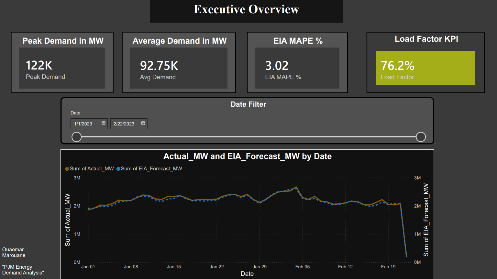

# PJM Energy Demand Forecasting

**Author:** Ouaomar Marouane  
**Data source:** U.S. Energy Information Administration (EIA) Open Data API  
**Grid operator:** PJM Interconnection, LLC — largest electricity grid in North America  
**Period covered:** January 1, 2023 – February 22, 2023 (hourly resolution)  
**Tools:** Python · Pandas · Prophet · XGBoost · SARIMA · SHAP · Power BI



---

## Problem Statement

Electricity cannot be stored at scale. Grid operators must forecast demand hours or days in advance to dispatch the right generation capacity, avoid blackouts, and minimize cost. This project builds and evaluates three forecasting models against the EIA's own published day-ahead forecast for PJM, using publicly available hourly load data.

---

## Project Structure

```
energy-demand-forecast-pjm/
│
├── README.md
├── requirements.txt
│
├── data/
│   ├── raw/                         # EIA API output (gitignored)
│   └── processed/                   # pjm_clean.parquet (gitignored)
│
├── notebooks/
│   ├── 01_data_loading.ipynb
│   ├── 02_preprocessing.ipynb
│   ├── 03_eda.ipynb
│   └── 04_modeling.ipynb
│
├── models/
│   ├── prophet_model.pkl
│   ├── xgboost_model.json
│   └── sarima_fit.pkl
│
├── dashboard/
│   └── pjm_dashboard.pdf
│
└── reports/
    ├── model_comparison.csv
    └── figures/
        ├── 01_decomposition.png
        ├── 02_demand_heatmap.png
        ├── 03_eia_vs_actual.png
        ├── 04_monthly_aggregations.png
        ├── 05_demand_by_hour.png
        ├── 06_correlation_matrix.png
        ├── 07_shap_importance.png
        └── 08_forecast_vs_actual.png
```

---

## Dataset

The EIA API returns hourly data in long format with four series per timestamp:

| Type Code | Description                          |
|---        |---                                   |
| D         | Actual demand (MW)                   |
| DF        | EIA day-ahead demand forecast (MW)   |
| NG        | Net generation (MW)                  |
| TI        | Total interchange — net exports (MW) |

The raw dataset contains 5,000 rows covering approximately 52 days at hourly frequency. After pivoting to wide format, cleaning, and removing the 7-day rolling window warm-up period, the working dataset spans the full January–February window.

---

## Methodology

### Phase 1 · Data Preparation

Raw CSV loaded with `parse_dates`, inspected for nulls (none found), and pivoted from long to wide format using `pivot_table`. Preprocessing steps:

- Forward-fill for any isolated missing hours
- Calendar features extracted: hour, day of week, month, year
- Weekend binary flag (Saturday = 1, Sunday = 1)
- Season mapping using meteorological boundaries
- Cyclical hour encoding via sine/cosine transform to preserve circularity (hour 23 adjacent to hour 0)
- 168-hour rolling mean on actual demand as a trend regressor

Output written to `data/processed/pjm_clean.parquet` (Parquet chosen for speed and ~4× size reduction over CSV).

### Phase 2 · Exploratory Data Analysis

Key techniques applied:

- Additive seasonal decomposition (period = 24 h) using `statsmodels`
- Demand heatmap: average load by hour of day × day of week
- EIA forecast accuracy baseline (MAPE)
- Monthly aggregations: average load, peak load, load factor
- Hour-of-day box plots showing intra-day spread
- Correlation matrix across all numeric features

### Phase 3 · Forecasting Models

Train/test split: last 30 days held out as test set. Time-series order preserved throughout — no shuffling.

**Model 1 — Facebook Prophet**  
Daily and weekly seasonality enabled. Yearly seasonality disabled (insufficient data length). Forecast produced for the full 30-day test horizon.

**Model 2 — SARIMA(1,1,1)×(1,1,1,24)**  
Fitted on the training demand series. Batch forecast for the test horizon. Captures both non-seasonal differencing and 24-hour seasonal structure.

**Model 3 — XGBoost with lag features**  
Features: lag_1h, lag_24h, lag_168h, plus all calendar and cyclical regressors from preprocessing. 300 estimators, learning rate 0.05, max depth 6. SHAP values computed to explain feature-level contributions.

---

## Key Findings

**Demand characteristics**

- Peak demand observed: **122,000 MW**
- Average demand across the period: **92,750 MW**
- Load factor: **76.2%** — the grid operated at roughly three-quarters of its peak capacity on average, indicating moderate but not extreme peaking behaviour
- Weekend demand averaged approximately **12% lower** than weekday demand, consistent with reduced industrial and commercial load (71.4% weekday vs 28.6% weekend share of total energy)
- Demand peaks concentrate in the **09:00–17:00 window on weekdays**, with overnight troughs between 01:00 and 05:00
- February demand tracked slightly lower than January in average terms, reflecting the tail end of the winter heating season

**Model results**

| Model             | RMSE (MW)   | MAPE (%) | MAE (MW)     | Train time (s) |
|---                |---          |---       |---           |---             |
| EIA Forecast (DF) | 3,435.6     | 3.02     | 2,808.4      | —              |
| **XGBoost**       | **3,986.8** | **3.11** | **2,896.8**  | 0.82           |
| Prophet           | 16,025.8    | 15.25    | 14,403.9     | 9.38           |
| SARIMA            | 23,451.6    | 21.38    | 18,886.9     | 0.30           |

**XGBoost achieved a MAPE of 3.11%**, within 0.09 percentage points of the EIA's own professionally produced day-ahead forecast (3.02%). This is the headline result of the project — a lag-feature ML model trained in under one second nearly matches an institutional forecast built with full weather data and domain expertise.

Prophet and SARIMA significantly underperformed on this dataset. The likely reason: both models rely on historical patterns within the training window to project forward. With only ~52 days of data and no weather covariates, neither has enough signal to capture demand volatility during winter cold snaps, which dominate the error in the test period. XGBoost, by contrast, learns directly from the most recent lag values (lag_1h, lag_24h) and responds faster to short-run level shifts.

**SHAP analysis** confirmed that lag_1h and lag_24h are the dominant predictors, contributing the most to individual forecast decisions. Calendar features (hour, dayofweek) contribute meaningful but secondary effects. The 7-day rolling average provides a stable baseline signal.

---

## Power BI Dashboard

The dashboard covers four pages: Executive Overview, Demand Patterns, Model Performance, and Forecast View.

[View dashboard on Power BI Service](https://usmsac-my.sharepoint.com/:u:/g/personal/marouaneouaomar_efb_usms_ac_ma/IQCPlOXGTYJhSLLWSPpJ5b-6AVwomCehrh6WQ0MfxyoUcQ8?e=R9Lruf)

---

## How to Reproduce

```bash
# 1. Clone the repository
git clone https://github.com/your-username/energy-demand-forecast-pjm.git
cd energy-demand-forecast-pjm

# 2. Create and activate environment
conda create -n energy python=3.11
conda activate energy

# 3. Install dependencies
pip install -r requirements.txt

# 4. Place raw EIA data
# Download from EIA API and save to: data/raw/eia_hourly_load.csv

# 5. Run notebooks in order
jupyter notebook
# 01_data_loading → 02_preprocessing → 03_eda → 04_modeling
```

**requirements.txt includes:** pandas, numpy, matplotlib, seaborn, plotly, prophet, scikit-learn, xgboost, shap, statsmodels, jupyter, openpyxl, pyarrow

---

## Limitations and Next Steps

The 52-day window is the main constraint. A full year of data would allow yearly seasonality modelling and expose summer cooling peaks, which represent PJM's annual demand maximum. Planned extensions:

- Join NOAA temperature data as an exogenous regressor for Prophet and SARIMA
- Extend to a multi-year training set (EIA data is available back to 2015)
- Add a gradient-boosted ensemble that combines Prophet components with XGBoost lag features
- Deploy the XGBoost model as a lightweight REST API for real-time hourly forecasting

---

## License

Data sourced from the U.S. Energy Information Administration, which makes its data freely available for public use. 
Code in this repository is MIT licensed.